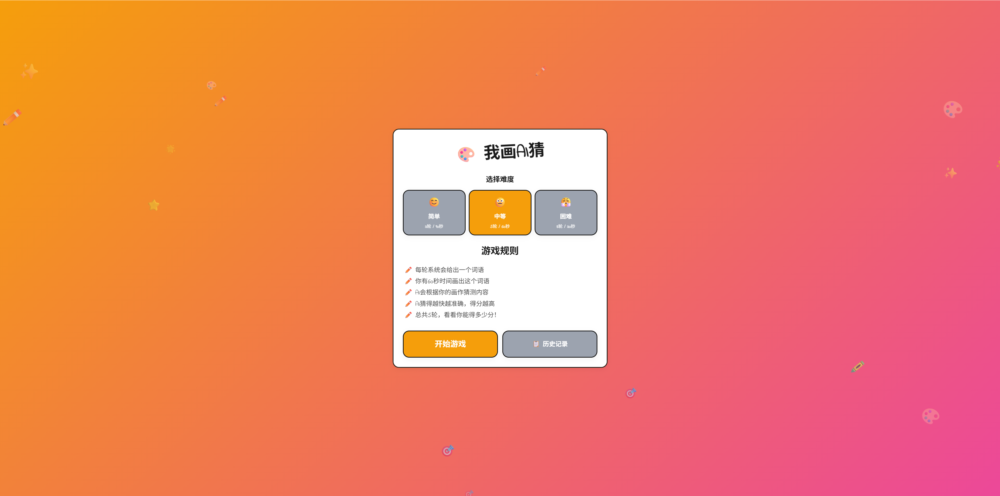
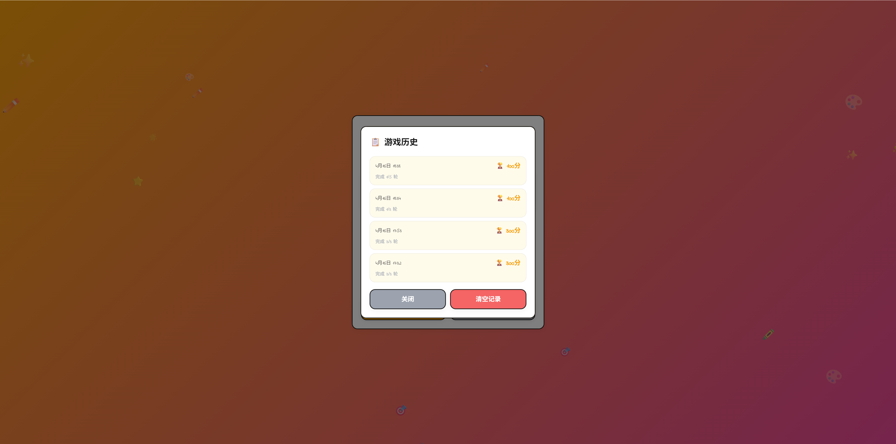
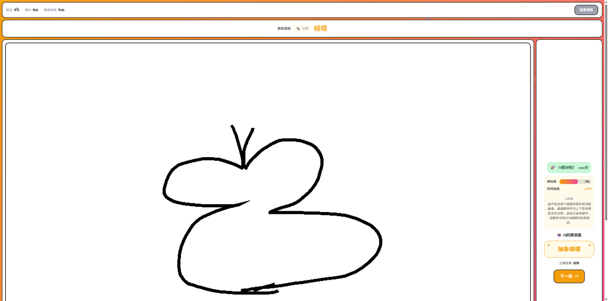

# 🎨 我画AI猜

一个有趣的互动绘画游戏，你画画，AI来猜！

## 功能特性

- 🖌️ **自由绘画**：支持多种颜色和笔触粗细
- 🤖 **AI识别**：集成AI智能识别画作内容
- ⏱️ **多轮挑战**：多轮次游戏，挑战你的绘画技巧
- 🎯 **难度选择**：简单/中等/困难三种难度
- 📊 **成绩记录**：保存游戏历史，记录最佳成绩
- 🔊 **音效&音乐**：丰富的游戏音效和背景音乐
- 📱 **响应式设计**：支持桌面和移动设备

## 技术栈

- **前端框架**：Vue 3 (Composition API)
- **构建工具**：Vite
- **样式**：SCSS
- **HTTP客户端**：Axios

## 项目结构

```
src/
├── components/
│   ├── Canvas/
│   │   └── DrawingCanvas.vue      # 绘画画布组件
│   ├── common/
│   │   └── AudioControls.vue       # 音频控制组件
│   ├── game/
│   │   ├── TopBar.vue              # 游戏顶部信息栏
│   │   ├── TargetWordBar.vue       # 目标词显示栏
│   │   ├── CanvasSection.vue       # 画布区域
│   │   └── ResultSection.vue       # AI结果区域
│   ├── modals/
│   │   ├── EndConfirmModal.vue     # 结束游戏确认弹窗
│   │   └── HistoryModal.vue        # 历史记录弹窗
│   ├── screens/
│   │   ├── StartScreen.vue         # 游戏开始界面
│   │   ├── GameScreen.vue          # 游戏进行中界面
│   │   └── GameOverScreen.vue      # 游戏结束界面
│   └── DoodleDecorations.vue       # 涂鸦装饰组件
├── composables/
│   ├── useGameFlow.js              # 游戏流程逻辑
│   ├── useAudio.js                  # 音频管理逻辑
│   ├── useHistory.js                # 历史记录逻辑
│   └── useDifficulty.js             # 难度选择逻辑
├── services/
│   └── aiService.js                 # AI识别服务
├── data/
│   └── wordLibrary.js               # 词库数据
├── assets/
│   └── style/
│       └── global.scss              # 全局样式
├── App.vue                           # 根组件
└── main.js                           # 入口文件
```

## 快速开始

### 安装依赖

```bash
npm install
```

### 配置环境变量

复制 `.env.example` 为 `.env` 并配置：

```env
VITE_AI_API_URL=your_ai_api_url
VITE_GAME_MAX_ROUNDS=5
VITE_GAME_DRAW_TIME=60
```

### 启动开发服务器

```bash
npm run dev
```

### 构建生产版本

```bash
npm run build
```

### 预览生产构建

```bash
npm run preview
```

## 游戏规则

1. 每轮系统会给出一个词语
2. 你有指定时间画出这个词语
3. AI会根据你的画作猜测内容
4. AI猜得越快越准确，得分越高
5. 完成所有轮次后查看最终成绩

## 难度设置

| 难度 | 轮数 | 绘画时间 |
|------|------|----------|
| 😊 简单 | 3轮 | 90秒 |
| 😐 中等 | 5轮 | 60秒 |
| 😤 困难 | 8轮 | 30秒 |

## 玩家称号

- 🏆 **绘画大师**：400分及以上
- 🎨 **灵魂画手**：250-399分
- ✏️ **创意画家**：100-249分
- 🌟 **初出茅庐**：0-99分

## 计分规则

- **基础分**：AI识别相似度 × 100
- **时间加成**：剩余时间越多，加成越高
- **总得分**：基础分 × 时间加成

## 游戏截图







## License

MIT
